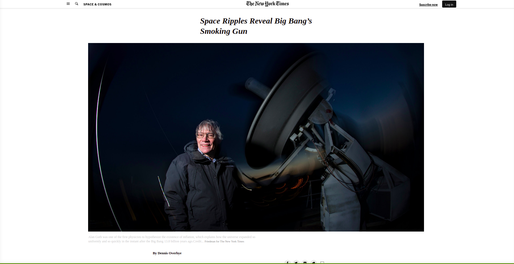

# NYT Clone - Positioning Elements (Microverse HTML/ CSS Module)

## Description
The rubric of this project is to demonstrate positioning of HTML elements using CSS3 flexbox, css3 grid and floats. [An article](https://www.nytimes.com/2014/03/18/science/space/detection-of-waves-in-space-buttresses-landmark-theory-of-big-bang.html?_r=0) from [The New York Times website](https://www.nytimes.com/) is the model for this project. The specification for this project is a part of [The Odin Project](https://www.theodinproject.com/).

## Library Directory 📙

| Contents                  |
| ------------------------- |
| [Live Demo](#live-demo) |
| [App Screenshot](#app-screenshot) |
| [Built With](#built-with)   |
| [Getting Started](#getting-started)   |
| [Testing](#testing)   |
| [Authors](#authors)       |
| [License](#license)       |

## Live Demo
[TheNextWebPageClone live demo](https://goofy-joliot-c43db5.netlify.app/)

## App Screenshot

## Built With

- HTML
- CSS
- 

## Getting Started

1. - Copy the git link `https://github.com/rloterh/NYTPageClone.git` of this project
2. - In your terminal run the command `git clone https://github.com/rloterh/NYTPageClone.git`
3. - Navigate to the cloned project directory
4. - Within the project root directory launch `index.html` in a web browser

## Testing

This project was tested using [W3C Validator](https://validator.w3.org/) and [Stylelint](https://stylelint.io/)
 

### Validating HTML Syntax

1. - Go to [The W3C Markup Validation Service](https://validator.w3.org/#validate_by_upload)
2. - Upload the file named `index.html` from the project directory
3. - Click on the check button to validate
4. - All test cases should pass, when no error message is shown 

### Validating CSS Syntax

1. - Run the command `npm -v` to ensure node package manager is installed
2. - Go to [npmjs.com](https://www.npmjs.com/get-npm) to install node package manager, if not installed
3. - Go to the terminal, and navigate to project directory
4. - Run the command `npm install`
5. - Validate the css syntax and code standard by running the command `npx stylelint "**/*.{css,scss}"`
6. - All test cases passes, when no error message is shown in the terminal

## Authors

### 👨‍💻 Robert Loterh

  
  
  
  

 ### 👨‍💻 Eyüp Sercan UYGUR

  
  
  
 

## 🤝 Contributing

Contributions, issues and feature requests are welcome!

Feel free to check the [issues page](https://github.com/rloterh/NYTPageClone/issues/new).

## Show your support

Give a ⭐️ if you like this project!

## Acknowledgments
- [The New York Times](https://www.nytimes.com/)
- [The Odin Project](https://www.theodinproject.com/)
- [Microverse](https://www.microverse.org/)

### License

